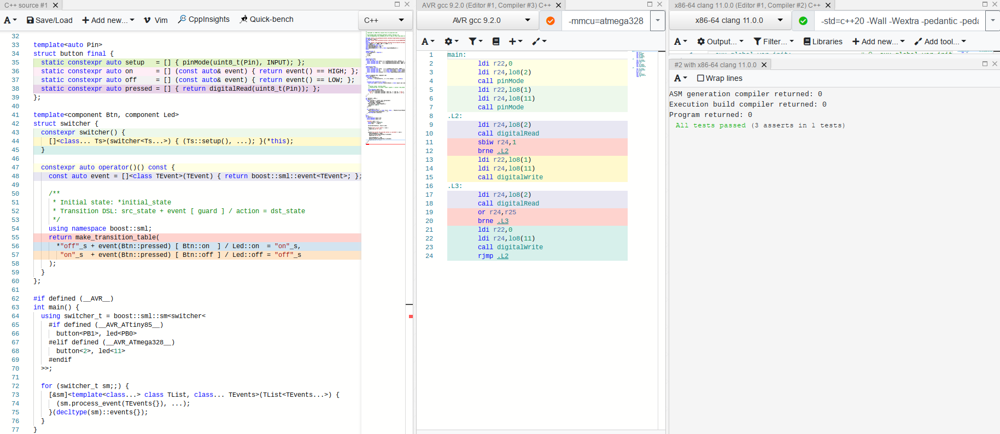
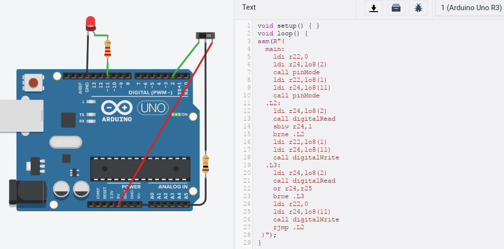

<a href="http://www.boost.org/LICENSE_1_0.txt" target="_blank"></a>
<a href="https://github.com/boost-ext/sml/releases" target="_blank"></a>
<a href="https://github.com/boost-ext/sml/actions/workflows/build_matrix.yml" target="_blank"></a>
<a href="https://codecov.io/gh/boost-ext/sml" target="_blank"></a>
<a href="https://godbolt.org/z/y99L50"></a>

---------------------------------------

# SML (State Machine Language)

> Your scalable C++14 **one header only** State Machine Library with no dependencies

<p align="center"><a href="https://www.youtube.com/watch?v=Zb6xcd2as6o"></a></p>

> https://www.youtube.com/watch?v=Zb6xcd2as6o

---

<p align="center">
  <br />
  <b>Let's release a TCP connection!</b>
  <br />
</p>

<p align="center"></p>

### Quick start

#### Download
> [Boost::ext].SML requires only one file. Get the latest header [here!](https://raw.githubusercontent.com/boost-ext/sml/master/include/boost/sml.hpp)

#### Include
```cpp
#include <boost/sml.hpp>
namespace sml = boost::sml;
```

#### Dependencies
```cpp
struct sender {
  template<class TMsg>
  constexpr void send(const TMsg& msg) { std::printf("send: %d\n", msg.id); }
};
```

#### Events
```cpp
struct ack { bool valid{}; };
struct fin { int id{}; bool valid{}; };
struct release {};
struct timeout {};
```

#### Guards
```cpp
constexpr auto is_valid = [](const auto& event) { return event.valid; };
```

#### Actions
```cpp
constexpr auto send_fin = [](sender& s) { s.send(fin{0}); };
constexpr auto send_ack = [](const auto& event, sender& s) { s.send(event); };
```

#### State Machine
```cpp
struct tcp_release {
  auto operator()() const {
    using namespace sml;
    /**
     * Initial state: *initial_state
     * Transition DSL: src_state + event [ guard ] / action = dst_state
     */
    return make_transition_table(
      *"established"_s + event<release>          / send_fin  = "fin wait 1"_s,
       "fin wait 1"_s  + event<ack> [ is_valid ]             = "fin wait 2"_s,
       "fin wait 2"_s  + event<fin> [ is_valid ] / send_ack  = "timed wait"_s,
       "timed wait"_s  + event<timeout>                      = X
    );
  }
};
```

#### Usage
```cpp
int main() {
  using namespace sml;

  sender s{};
  sm<tcp_release> sm{s}; // pass dependencies via ctor
  assert(sm.is("established"_s));

  sm.process_event(release{}); // complexity O(1)
  assert(sm.is("fin wait 1"_s));

  sm.process_event(ack{true}); // prints 'send: 0'
  assert(sm.is("fin wait 2"_s));

  sm.process_event(fin{42, true}); // prints 'send: 42'
  assert(sm.is("timed wait"_s));

  sm.process_event(timeout{});
  assert(sm.is(X));  // terminated
}
```

> MSVC-2015 ([Example](https://boost-ext.github.io/sml/examples/index.html#hello-world))

  * use `state<class state_name>` instead of `"state_name"_s`
  * expliclty state a lambda's result type `auto action = [] -> void {}`

#### Compile
* **GCC/Clang**
  ```sh
  $CXX -std=c++14 -O2 -fno-exceptions -Wall -Wextra -Werror -pedantic tcp_release.cpp
  ```
* **MSVC**
  ```sh
  cl /std:c++14 /Ox /W3 tcp_release.cpp
  ```

<p align="center">
<table>
  <tr>
    <th>tcp_release.cpp</th>
    <th>Clang-3.8</th>
    <th>GCC-6.3</th>
    <th>MSVC-2015</th>
  </tr>

  <tr>
    <td>Compilation Time</td>
    <td>0.102s</td>
    <td>0.118s</td>
    <td>0.296s</td>
  </tr>

  <tr>
    <td>Binary size (stripped)</td>
    <td>6.2kb</td>
    <td>6.2kb</td>
    <td>105kb</td>
  </tr>

  <tr>
    <td>ASM x86-64 - <br/>https://godbolt.org/z/y99L50</td>
    <td colspan="3">
      <pre><code>
main: # @main
  pushq %rax
  movl $.L.str, %edi
  xorl %esi, %esi
  xorl %eax, %eax
  callq printf
  movl $.L.str, %edi
  movl $42, %esi
  xorl %eax, %eax
  callq printf
  xorl %eax, %eax
  popq %rcx
  retq
.L.str:
  .asciz "send: %d\n"
      </code></pre>
    </td>
  </tr>
</table>
</p>

#### Run
> Output (https://wandbox.org/permlink/WbvV9HsIyiPkCFw7)
```sh
send: 0
send: 42
```

### Benchmark

> [Complex Test](https://github.com/boost-ext/sml/tree/master/benchmark/complex)

|                  |[Enum/Switch](https://github.com/boost-ext/sml/blob/master/benchmark/complex/switch.cpp) | [Variant](https://github.com/boost-ext/sml/blob/master/benchmark/complex/variant.cpp) | [[Boost::ext].SML - 1.1.0](https://github.com/boost-ext/sml/blob/master/benchmark/complex/sml.cpp)    | [Boost-1.65.MSM-eUML](https://github.com/boost-ext/sml/blob/master/benchmark/complex/euml.cpp)   | [Boost-1.65.Statechart](https://github.com/boost-ext/sml/blob/master/benchmark/complex/sc.cpp)   |
|------------------|------------|---------|--------------|------------------|--------------------|
| **Compilation time** |  0.132s    | 15.321s |       0.582s |        1m15.935s |             5.671s |
| **Execution time**   |   679ms    | 827ms   |        622ms |        664ms     |             2282ms |
| **Memory usage**     |      1b    | 2b/8b   |           1b |        120b      |             224b   |
| **Executable size**  |     15K    | 187K    |          34K |        611K      |             211K   |

---

### Examples

<a name="arduino"></a>
* #### [Arduino](https://www.arduino.cc)

<p align="center"><a href="http://www.plantuml.com/plantuml/uml/TP11Qy9048Nl-HNlPYnj4ZtcK4JheQtq4kX5HDRiRB9LTyFiXDH_twmM2WKl2n_xFjvZ5a4KIty-9PDaWfNlBcoRLf3MKyoBUO5tjW5lVR3gYFGOGGc-Rgozm95Ch-wB3SBsq0jfz4uJGrh2qliWgBoHGJ5XOsjoWHxnIHoiTvXbHJRAQKK4LTV-t2btiQw1iQSn_hfQVrJh_MnVPF8jy8nwd1Wdj29TcUV3C6I7s95vRl9_-JWCs3xiyFGCRqo2-5x10IMMuigoOmg1DBOtZ3yxvDYGZX0LXr__dcBCdn9h5kJqUD8V"></a></p>

<p align="center"><a href="https://godbolt.org/z/Y983h4"></a></p>

> https://godbolt.org/z/Y983h4

<p align="center"><a href="https://www.tinkercad.com/things/9epUrFrzKP3"></a></p>

> https://www.tinkercad.com/things/9epUrFrzKP3

---

<a name="avr"></a>
* #### [AVR](https://www.arduino.cc)

<p align="center"><a href="https://godbolt.org/z/qhx8Md"></a></p>

> https://godbolt.org/z/qhx8Md

---

<a name="match3"></a>
* #### [Match3](https://github.com/modern-cpp-examples/match3)

<table>
  <tr>
    <td>
      <p align="center"><a href="https://www.youtube.com/watch?v=8gRHHIjx4oE"></a></p>
    </td>
    <td>
      <p align="center"><a href="http://modern-cpp-examples.github.io/match3/"></a></p>
    </td>
  </tr>
</table>

> https://github.com/modern-cpp-examples/match3

---------------------------------------

### Documentation

[](GENERATE_TOC_BEGIN)

* [Introduction](https://boost-ext.github.io/sml/index.html)
    * [UML State Machine](https://boost-ext.github.io/sml/index.html#uml-state-machine)
    * [Do I need a State Machine?](https://boost-ext.github.io/sml/index.html#do-i-need-a-state-machine)
    * [Real Life examples?](https://boost-ext.github.io/sml/index.html#real-life-examples)
    * [Why [Boost].SML?](https://boost-ext.github.io/sml/index.html#why-boostsml)
    * [Problems with Boost.MSM - eUML](https://boost-ext.github.io/sml/index.html#problems-with-boostmsm-euml)
    * [[Boost].SML design goals](https://boost-ext.github.io/sml/index.html#boostsml-design-goals)
    * [What 'lite' implies?](https://boost-ext.github.io/sml/index.html#what-lite-implies)
    * [*Supported* UML features](https://boost-ext.github.io/sml/index.html#supported-uml-features)
    * [*Additional* features](https://boost-ext.github.io/sml/index.html#additional-features)
    * [Related materials](https://boost-ext.github.io/sml/index.html#related-materials)
    * [Acknowledgements](https://boost-ext.github.io/sml/index.html#acknowledgements)
* [Overview](https://boost-ext.github.io/sml/overview.html)
    * [Quick Start](https://boost-ext.github.io/sml/overview.html#quick-start)
    * [Dependencies](https://boost-ext.github.io/sml/overview.html#dependencies)
    * [Supported/Tested compilers](https://boost-ext.github.io/sml/overview.html#supportedtested-compilers)
    * [Configuration](https://boost-ext.github.io/sml/overview.html#configuration)
    * [Exception Safety](https://boost-ext.github.io/sml/overview.html#exception-safety)
    * [Thread Safety](https://boost-ext.github.io/sml/overview.html#thread-safety)
    * [Design](https://boost-ext.github.io/sml/overview.html#design)
    * [Error messages](https://boost-ext.github.io/sml/overview.html#error-messages)
* [Features/Benchmarks](https://boost-ext.github.io/sml/benchmarks.html)
    * [Features](https://boost-ext.github.io/sml/benchmarks.html#features)
    * [Benchmarks](https://boost-ext.github.io/sml/benchmarks.html#benchmarks)
* [Tutorial/Workshop](https://boost-ext.github.io/sml/tutorial.html)
    * [0. Read Boost.MSM - eUML documentation](https://boost-ext.github.io/sml/tutorial.html#0-read-boostmsm-euml-documentation)
    * [1. Create events and states](https://boost-ext.github.io/sml/tutorial.html#1-create-events-and-states)
    * [2. Create guards and actions](https://boost-ext.github.io/sml/tutorial.html#2-create-guards-and-actions)
    * [3. Create a transition table](https://boost-ext.github.io/sml/tutorial.html#3-create-a-transition-table)
    * [4. Set initial states](https://boost-ext.github.io/sml/tutorial.html#4-set-initial-states)
    * [5. Create a state machine](https://boost-ext.github.io/sml/tutorial.html#5-create-a-state-machine)
    * [6. Process events](https://boost-ext.github.io/sml/tutorial.html#6-process-events)
    * [8. Handle errors](https://boost-ext.github.io/sml/tutorial.html#8-handle-errors)
    * [9. Test it](https://boost-ext.github.io/sml/tutorial.html#9-test-it)
    * [10. Debug it](https://boost-ext.github.io/sml/tutorial.html#10-debug-it)
* [UML vs SML](https://boost-ext.github.io/sml/uml_vs_sml.html)
    * [Unified Modeling Language™ (UML®) Version 2.5](https://boost-ext.github.io/sml/uml_vs_sml.html#unified-modeling-language-uml-version-25)
    * [Initial Pseudostate](https://boost-ext.github.io/sml/uml_vs_sml.html#initial-pseudostate)
    * [Terminate Pseudostate](https://boost-ext.github.io/sml/uml_vs_sml.html#terminate-pseudostate)
    * [External transition](https://boost-ext.github.io/sml/uml_vs_sml.html#external-transition)
    * [Anonymous transition](https://boost-ext.github.io/sml/uml_vs_sml.html#anonymous-transition)
* [User Guide](https://boost-ext.github.io/sml/user_guide.html)
    * [transitional [concept]](https://boost-ext.github.io/sml/user_guide.html#transitional-concept)
    * [configurable [concept]](https://boost-ext.github.io/sml/user_guide.html#configurable-concept)
    * [callable [concept]](https://boost-ext.github.io/sml/user_guide.html#callable-concept)
    * [dispatchable [concept]](https://boost-ext.github.io/sml/user_guide.html#dispatchable-concept)
    * [state [core]](https://boost-ext.github.io/sml/user_guide.html#state-core)
    * [event [core]](https://boost-ext.github.io/sml/user_guide.html#event-core)
    * [make_transition_table [state machine]](https://boost-ext.github.io/sml/user_guide.html#make_transition_table-state-machine)
    * [sm [state machine]](https://boost-ext.github.io/sml/user_guide.html#sm-state-machine)
    * [policies [state machine]](https://boost-ext.github.io/sml/user_guide.html#policies-state-machine)
    * [testing::sm [testing]](https://boost-ext.github.io/sml/user_guide.html#testingsm-testing)
    * [make_dispatch_table [utility]](https://boost-ext.github.io/sml/user_guide.html#make_dispatch_table-utility)
* [Examples](https://boost-ext.github.io/sml/examples.html)
    * [Hello World](https://boost-ext.github.io/sml/examples.html#hello-world)
    * [Events](https://boost-ext.github.io/sml/examples.html#events)
    * [States](https://boost-ext.github.io/sml/examples.html#states)
    * [Actions Guards](https://boost-ext.github.io/sml/examples.html#actions-guards)
    * [Transitions](https://boost-ext.github.io/sml/examples.html#transitions)
    * [Defer/Process](https://boost-ext.github.io/sml/examples.html#deferprocess)
    * [Orthogonal Regions](https://boost-ext.github.io/sml/examples.html#orthogonal-regions)
    * [Composite](https://boost-ext.github.io/sml/examples.html#composite)
    * [History](https://boost-ext.github.io/sml/examples.html#history)
    * [Error handling](https://boost-ext.github.io/sml/examples.html#error-handling)
    * [Logging](https://boost-ext.github.io/sml/examples.html#logging)
    * [Nested](https://boost-ext.github.io/sml/examples.html#nested)
    * [Testing](https://boost-ext.github.io/sml/examples.html#testing)
    * [Runtime Dispatcher](https://boost-ext.github.io/sml/examples.html#runtime-dispatcher)
    * [eUML Emulation](https://boost-ext.github.io/sml/examples.html#euml-emulation)
    * [Dependencies](https://boost-ext.github.io/sml/examples.html#dependencies)
    * [Data](https://boost-ext.github.io/sml/examples.html#data)
    * [In-Place](https://boost-ext.github.io/sml/examples.html#in-place)
    * [Dependency Injection](https://boost-ext.github.io/sml/examples.html#dependency-injection)
    * [Arduino Integration](https://boost-ext.github.io/sml/examples.html#arduino-integration)
    * [SDL2 Integration](https://boost-ext.github.io/sml/examples.html#sdl2-integration)
    * [Plant UML Integration](https://boost-ext.github.io/sml/examples.html#plant-uml-integration)
* [FAQ](https://boost-ext.github.io/sml/faq.html)
* [CHANGELOG](https://boost-ext.github.io/sml/CHANGELOG.html)
    * [[1.1.9] - 2023-09-13](https://boost-ext.github.io/sml/CHANGELOG.html#119-2023-09-13)
    * [[1.1.6] - 2022-09-07](https://boost-ext.github.io/sml/CHANGELOG.html#116-2022-09-07)
    * [[1.1.5] - 2022-03-23](https://boost-ext.github.io/sml/CHANGELOG.html#115-2022-03-23)
    * [[1.1.4] - 2021-02-16](https://boost-ext.github.io/sml/CHANGELOG.html#114-2021-02-16)
    * [[1.1.3] - 2020-08-02](https://boost-ext.github.io/sml/CHANGELOG.html#113-2020-08-02)
    * [[1.1.2] - 2020-06-14](https://boost-ext.github.io/sml/CHANGELOG.html#112-2020-06-14)
    * [[1.1.1] - 2020-05-17](https://boost-ext.github.io/sml/CHANGELOG.html#111-2020-05-17)
    * [[1.1.0] - 2019-01-08](https://boost-ext.github.io/sml/CHANGELOG.html#110-2019-01-08)
    * [[1.0.1] - 2016-05-06](https://boost-ext.github.io/sml/CHANGELOG.html#101-2016-05-06)
    * [[1.0.0] - 2016-01-28](https://boost-ext.github.io/sml/CHANGELOG.html#100-2016-01-28)
[](GENERATE_TOC_END)

---

**Disclaimer** `[Boost::ext].SML` is not an official Boost library.
