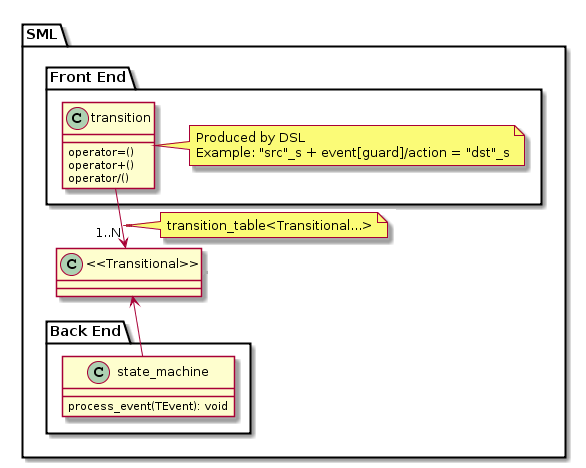

###Quick Start

* Get [boost/sml.hpp](https://raw.githubusercontent.com/boost-ext/sml/master/include/boost/sml.hpp) header
```sh
wget https://raw.githubusercontent.com/boost-ext/sml/master/include/boost/sml.hpp
```

* Include the header and define `sml` namespace alias
```cpp
#include "boost/sml.hpp"
namespace sml = boost::sml;
```

* Compile with C++14 support
```sh
$CXX -std=c++14 ... | cl /std:c++14 ...
```

* To run tests
```sh
git clone https://github.com/boost-ext/sml && cd sml && make test
```

###Dependencies

* No external dependencies are required (neither STL nor Boost)

###Supported/Tested compilers

* [Clang-3.4+](https://travis-ci.org/boost-ext/sml)
* [GCC-5.2+](https://travis-ci.org/boost-ext/sml)
* [MSVC-2015](https://ci.appveyor.com/project/krzysztof-jusiak/sml)
    * Known limitations

```cpp
  "src_state"_s + event<e> = "dst_state"_s                                // Error on MSVC-2015, Ok on GCC-5+, Clang-3.4+
  state<class src_state> + event<e> = state<class dst_state>              // Ok on all supported compilers
```

```cpp
  const auto guard1 = [] { return true; }
  state<class a> + event<e> [ guard1 ] / [](const auto& event) {}          // Error on MSVC-2015, Ok on GCC-5+, Clang-3.4+

  const auto guard2 = [] -> bool { return true; }
  state<class a> + event<e> [ guard2 ] / [](const auto& event) -> void {}  // Ok on all supported compilers
```

###Configuration
| Macro                                                         | Description                                                  |
| --------------------------------------------------------------|--------------------------------------------------------------|
| `BOOST_SML_VERSION`                                           | Current version of [Boost].SML (ex. 1'1'13)                |
| `BOOST_SML_CFG_ENABLE_MIN_SIZE`                               | Opt in to the empty-SM size trick (zero-size array); disabled by default, see note below |
| `BOOST_SML_CFG_DISABLE_MIN_SIZE`                              | Legacy name kept for backward compatibility; the min-size trick is now disabled by default |
| `BOOST_SML_DISABLE_EXCEPTIONS`                                | Build with exceptions disabled (e.g. with `-fno-exceptions`) |
| `BOOST_SML_CREATE_DEFAULT_CONSTRUCTIBLE_DEPS`                 | Allow default-constructing dependencies owned by the State Machine |

> **Note (min-size):** Since the changes after `v1.1.13`, the empty-State-Machine
> size optimization is **off by default** on GCC/Clang because the zero-length-array
> trick triggered undefined behavior at `-O2` (UBSan violations). As a result,
> `sizeof(sm<...>)` for an empty State Machine may differ from earlier releases.
> Define `BOOST_SML_CFG_ENABLE_MIN_SIZE` to opt back in.


###Exception Safety

* [Boost].SML doesn't use exceptions internally and therefore might be compiled with `-fno-exceptions`.
* If guard throws an exception [State Machine](user_guide.md##sm-state-machine) will stay in a current state.
* If action throws an exception [State Machine](user_guide.md##sm-state-machine) will be in the new state
* Exceptions might be caught using transition table via `exception` event. See [Error handling](tutorial.md#8-error-handling).

###Thread Safety

* [Boost].SML is not thread safe by default.
  * Thread Safety might be enabled by defining a thread_safe policy when creating a State Machine. Lock type has to be provided.

```cpp
sml::sm<example, sml::thread_safe<std::recursive_mutex>> sm;
sm.process_event(event{}); // thread safe call
```

* See [Thread Safe Policy](user_guide.md#policies)

###Design

[](images/design.png)

| Component    | Description |
| ------------ | ----------- |
| [Front-End]  | Transition Table Domain Specific Language |
| [Back-End]   | [State Machine](user_guide.md##sm-state-machine) implementation details |

###Error messages

***Not configurable***

[▶ See the compile error on Compiler Explorer](https://godbolt.org/z/3ceoa8fP4)

***Not callable***

[▶ See the compile error on Compiler Explorer](https://godbolt.org/z/Wv9rbG7ab)

***Not transitional***

[▶ See the compile error on Compiler Explorer](https://godbolt.org/z/6P7qf1qvv)

***Not dispatchable***

[▶ See the compile error on Compiler Explorer](https://godbolt.org/z/5cWcc98x1)

[Boost.MSM-eUML]: http://www.boost.org/doc/libs/1_60_0/libs/msm/doc/HTML/ch03s04.html
[Boost.MSM3-eUML2]: https://htmlpreview.github.io/?https://raw.githubusercontent.com/boostorg/msm/msm3/doc/HTML/ch03s05.html
[Boost.Statechart]: http://www.boost.org/doc/libs/1_60_0/libs/statechart/doc/tutorial.html
